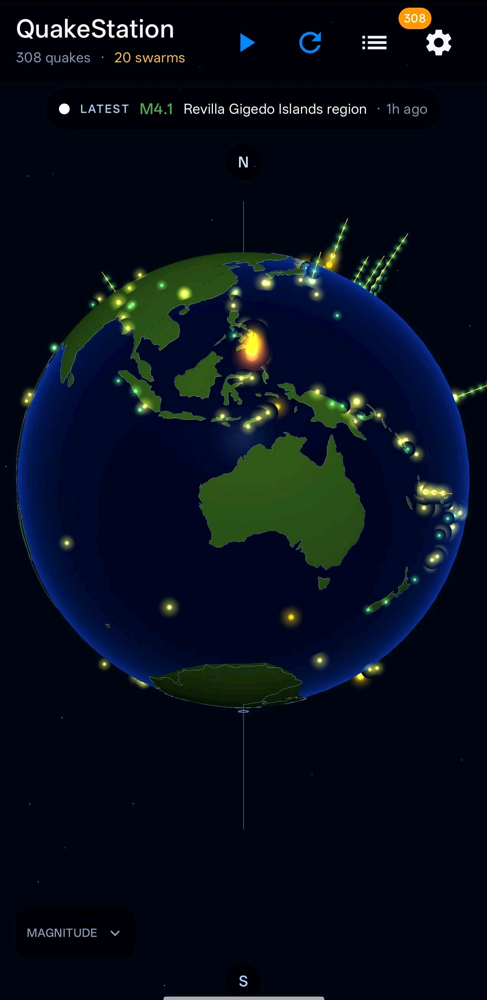

# QuakeSphere

A real-time and historical earthquake tracker for Android, built around a
custom 3D OpenGL globe. Pulls live event data from the USGS FDSNWS catalog,
detects swarms, animates magnitude-scaled ripples on the sphere, and lets
you replay the past 24 hours / 7 days / 30 days as a time-lapse over the
globe.

> **Status:** active development. Targets Android 8.0+ (API 26), tested on
> phones from API 33 (Android 13) through API 34. Single-handed,
> portrait-first UI; no tablet layout yet.

<p align="center">
  
  
  
  
</p>

## Features

- **Cinematic 3D globe** — custom OpenGL ES 2.0 renderer, eased camera, two-
  light shading (fixed view light + real-time UTC subsolar overlay for a
  subtle day/night terminator), star field, atmosphere rim glow.
- **Live data** — USGS FDSNWS Event API, with a Room cache so the app loads
  instantly when offline. Background sync via WorkManager.
- **Swarm detection** — greedy 200 km / 48 h clustering (`DetectSwarmsUseCase`),
  rendered as radial "spines" that grow taller with more events.
- **Tap to focus** — tap a marker for details, tap a swarm spine for the
  swarm summary, tap a news-banner headline to fly the camera to that event.
- **Tectonic plates overlay** — PB2002 (Bird 2003) plate boundaries, toggle in
  settings.
- **Historic-trends heatmap** — derived at first launch from plate-boundary
  proximity (Gaussian splat, σ ≈ 4.5°). A deterministic proxy for M5+ density
  that doesn't need any offline data pipeline. Built on a background thread
  so it never blocks first paint.
- **Replay** — hit ▶ in the header to play back every quake in your selected
  time window in chronological order, ~1.5 s per quake. Markers reveal
  cumulatively; the camera flies to each new event.
- **Notifications** — set a magnitude threshold in settings; periodic
  background sync fires a notification for any new event above it.
- **Settings** — magnitude floor, time range, depth filter, distance units,
  marker colour mode (depth vs magnitude), sync interval, all toggles for
  continent lines / stars / auto-rotate / plates / heatmap.

## Getting started

```bash
# from the repo root
./gradlew assembleDebug
# install the resulting APK on a connected device
adb install app/build/outputs/apk/debug/app-debug.apk
```

Requirements:
- JDK 17 (Eclipse Adoptium recommended)
- Android SDK with API 34 platform
- AGP 8.2.2 / Gradle 8.7 / Kotlin 1.9.22 (managed by the wrapper)

No API keys needed — USGS FDSNWS is public.

## Architecture

Clean Architecture with three layers (`domain` / `data` / `ui`), Hilt for DI,
Room for local storage, Retrofit for the USGS API, DataStore for settings,
WorkManager for background sync, Jetpack Compose for everything except the
OpenGL globe surface.

The globe lives in its own Gradle module (`:globe`) so it can be lifted out
into a standalone library later. It only knows about generic `Marker` /
`MarkerStack` / `RippleSpec` types — domain models are mapped at the screen
boundary.

```
app/
  ├─ domain/        pure-Kotlin models, repositories, use cases
  ├─ data/          USGS API + Room cache + repository impl
  ├─ ui/            Compose screens (globe, list, detail, settings)
  ├─ work/          periodic sync worker
  └─ notification/  notification builder
globe/             reusable OpenGL ES 2.0 globe view + renderer
```

See [CLAUDE.md](CLAUDE.md) for design notes and the non-obvious decisions
worth remembering across sessions.

## Permissions

- `INTERNET` — fetching USGS data
- `RECEIVE_BOOT_COMPLETED` — re-arm the periodic sync after a reboot
- `POST_NOTIFICATIONS` — requested at runtime on Android 13+. If you deny, the
  app still works; you just won't get notifications.

## Data sources & credits

- Earthquake catalog — [USGS FDSNWS Event API](https://earthquake.usgs.gov/fdsnws/event/1/)
- Continent polygons — [Natural Earth](https://www.naturalearthdata.com/) 110m
- Tectonic plate boundaries — Bird, P. (2003) [PB2002](https://doi.org/10.1029/2001GC000252)
- Polygon triangulation — Kotlin port of [Mapbox earcut](https://github.com/mapbox/earcut)

## License

See [LICENSE](LICENSE) if present; otherwise treat as all-rights-reserved
until one is added.
